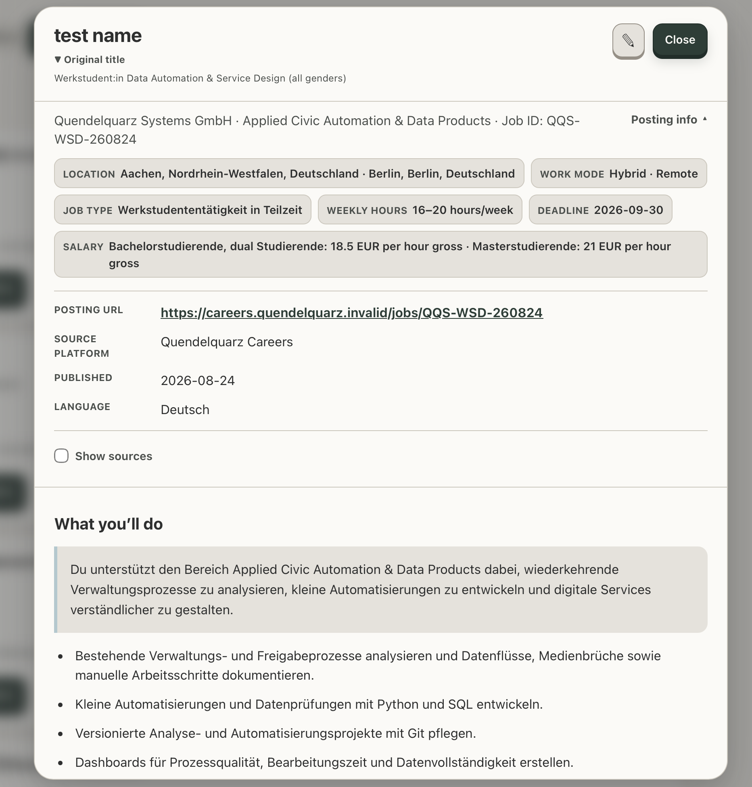
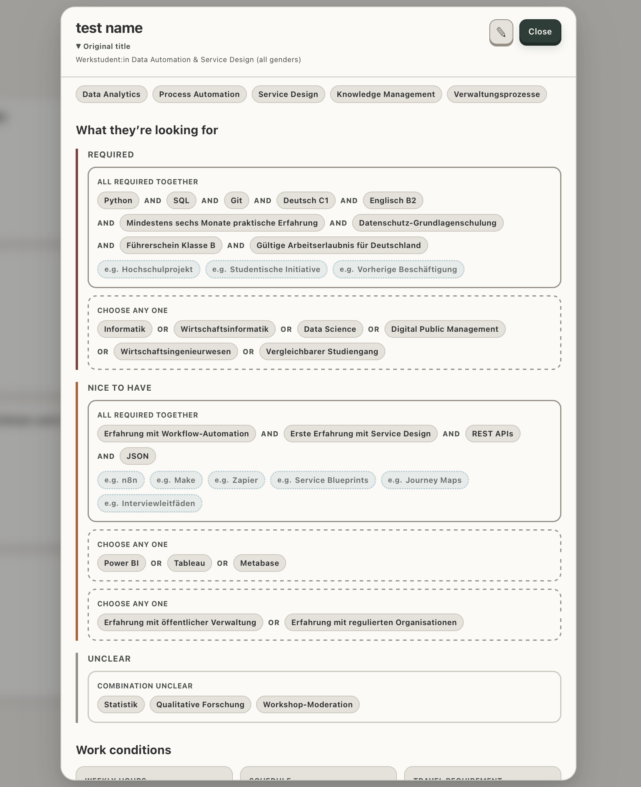
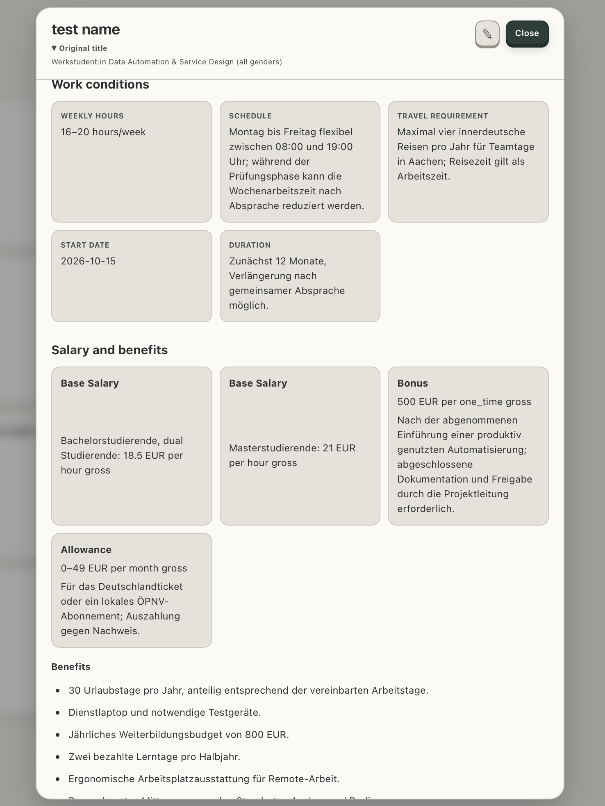
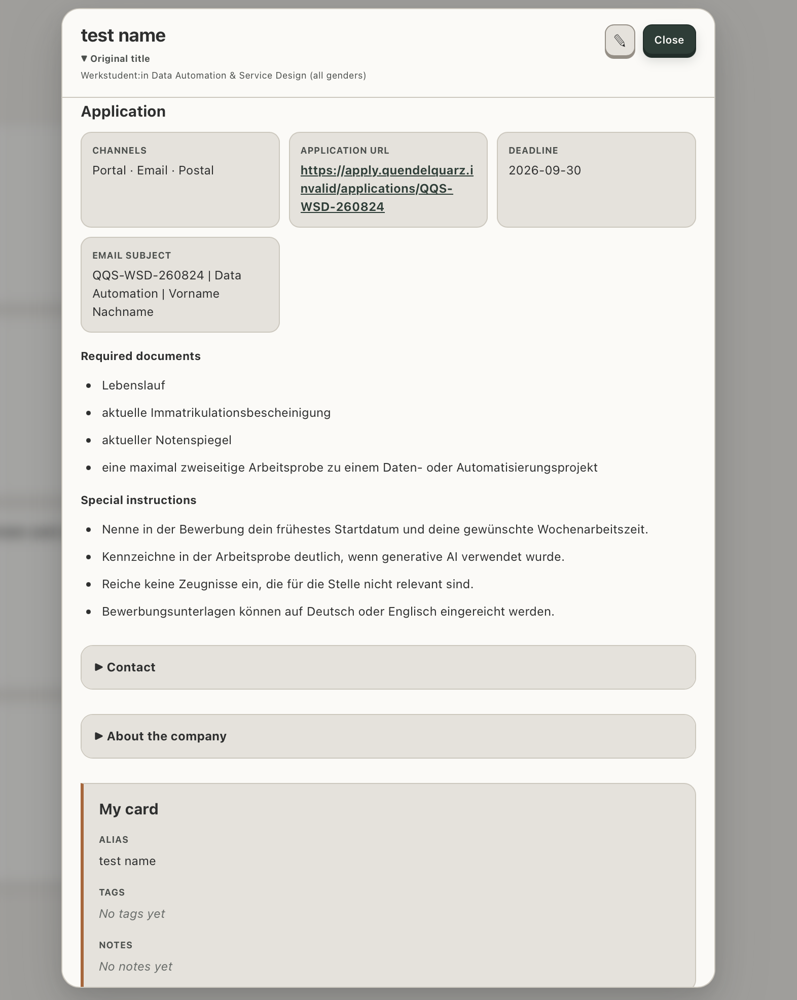

# Tracer

[](https://github.com/dylanxc-cnde/Tracer/actions/workflows/ci.yml)

**Turn messy job pages into structured records you can actually review.**

Tracer is a job-search workspace for internships, working-student roles, HiWi
jobs, and thesis openings in Germany. Paste a posting, check what the AI picked
out, and keep it in a local Card library—with the source text close by and
space for your own notes.

The idea is simple: spend less time digging through job pages and more time
figuring out which roles are worth a closer look.

```text
job URL or pasted text
-> AI retrieval and structured extraction
-> evidence, unknowns, and ambiguities
-> user selects a posting
-> confirmed Posting Card in SQLite
-> reopen, edit user fields, or view the original saved card
```

## Current Card UI

Here's a look at the Card view: the job posting, broken into sections you can
scan and check. These screenshots use a fictional posting, with no real
employer or applicant data. A few newer controls, including Show original,
aren't pictured yet. Click an image for a closer look.

| Overview and quick facts | Structured requirements |
| --- | --- |
| [](docs/images/card_overview.png) | [](docs/images/card_requirements.png) |
| Work conditions and compensation | Application details and My Card |
| [](docs/images/card_workconditions.png) | [](docs/images/card_application.png) |

## What works now

- Pydantic models for imports, parsed posting details, and confirmed cards;
- local SQLite storage for posting imports and confirmed cards;
- an OpenAI Responses API parser with a shared prompt and strict structured output;
- a small FastAPI HTTP API for imports, parse results, and confirmed cards;
- a working React and TypeScript browser flow from pasted text to a saved card;
- local Card and Import libraries that reload records from SQLite;
- explicit, confirmed deletion for saved Cards and Import history;
- a Card Details dialog with quick facts, role content, requirements,
  work conditions, compensation, application and contact details, company
  information, source excerpts, and creation metadata;
- a global Card edit mode that saves a user-owned alias, string tags, and notes
  back to SQLite while preserving posting facts and sources;
- an initial Card snapshot alongside the current saved version, with a
  read-only Show original action in Card Library;
- disabled user-field inputs and tag controls while saving, with the draft
  retained if saving fails;
- a responsive three-page application shell with class-based component styles;
- selectable posting candidates with loading, error, and confirmation states;
- section-level source excerpts and URLs for reviewing extracted facts;
- multiple posting candidates without mixing in recommended jobs;
- compact requirement pills grouped by importance and displayed in
  `all_of -> any_of -> unknown` order, with examples on a separate row;
- explicit ambiguities when a value cannot be classified safely.

The AI gives you a starting point, not the final word. Missing information
stays unknown, and you review and select a posting before saving it as a Card.

Card storage keeps two full JSON payloads in the same row: the initial saved
Card and the current version. Updates replace only the current version. The
initial snapshot is not a web-page archive or a history of every edit, and
deleting a Card removes both versions. Only alias, tags, and notes are editable
today; structured posting facts remain read-only. For older records backfilled
into this layout, the original snapshot starts at migration time, not before.

## Run the checks

Tracer uses Python 3.12 and [uv](https://docs.astral.sh/uv/).

```bash
uv sync
uv run pytest
```

```bash
cd frontend
npm ci
npm run lint
npm run build
```

CI runs Python tests, frontend lint, and the TypeScript/Vite build on pushes
and pull requests. Frontend component and API behavior tests are not yet set
up; a passing build does not cover browser interactions.

## Run the local app

Start FastAPI from the repository root:

```bash
uv run --env-file .env.local fastapi dev src/tracer/api/app.py
```

Then start the frontend in another terminal:

```bash
cd frontend
npm ci
npm run dev
```

Open `http://localhost:5173`. Paste a posting, analyze it, select one candidate,
and confirm it to create a saved Posting Card. Open
`http://127.0.0.1:8000/docs` to inspect the API directly.

In Card Library, select Load card library, then View details to review or edit
the current Card. Show original opens its initial snapshot without edit
controls. Import History has its own Load button. Automatic page-entry refresh
and preservation of Library/History page state are still pending.

The posting routes are:

```text
POST /posting-imports
GET  /posting-imports
GET  /posting-imports/{import_key}
DELETE /posting-imports/{import_key}
POST /posting-imports/{import_key}/parse-results
POST /posting-cards
GET  /posting-cards
GET  /posting-cards/{card_key}
GET  /posting-cards/{card_key}/original
PATCH /posting-cards/{card_key}
DELETE /posting-cards/{card_key}
```

The local database is created at `.local/tracer.sqlite3`. Calling Analyze
requires an OpenAI API key and uses paid API credits. If the key is already
exported in the shell, the `--env-file .env.local` option is not needed.

An existing database from an older schema is not automatically migrated by
app startup. Back it up before any manual migration; the project does not yet
provide a supported upgrade or recovery workflow.

## Try the parser

The public example uses a fictional job posting from
`examples/sample_posting.txt`.

Set `OPENAI_API_KEY` in your shell or in an ignored `.env.local` file, then
run:

```bash
uv run --env-file .env.local python examples/try_posting_parse.py
```

The example currently uses `gpt-5.6-luna` and requires at least one web search.
It sends the sample text to the OpenAI API and uses paid API credits.

Real job pages, API outputs, application records, and keys are not included in
the repository.

## Next

- extend the existing Card Details section components one field shape and one
  business section at a time; display extraction and requirement ordering are
  already in place;
- define each section's editable contract, then connect its draft, validation,
  save, and reopen flow; keep any further component moves separate from behavior
  changes so each step stays reviewable;
- keep headers and Quick Facts as read-only projections while editing their
  underlying structured fields;
- build quiet inline editing surfaces and section-level add controls without
  turning Card Details into one generic JSON form;
- signal only unsaved draft changes in the UI while preserving the original
  section-level source context;
- design a stable tag catalog and selection UI only when filtering and matching
  need more than the current string tags;
- show the relationship between an Import and the Cards created from it;
- keep validation, not-found, concurrent-update, and storage failures visible
  to the frontend rather than hiding them behind a generic success state.

The editing UI is still an early version. Page refresh behavior and overlapping
request handling are deferred until the relevant interactions are refined;
automatic refresh alone will not prevent an old response from replacing newer
UI state.

Deleting a Card does not delete its original Import. Deleting an Import does
not delete saved Cards either: a Card keeps its `import_key` as historical
context, and code that follows the reference must handle a missing Import.

After that, the next product layer is a small Candidate Profile, job-search
goals, and explainable requirement matching. Tracer should ask for extra
preferences only when a feature needs them—for example, Anschreiben tone when
the user first creates an Anschreiben—not through one large setup form.

Longer-term experiments include a budget-aware daily job brief, application
planning around a desired start date, materials and application timelines, and
a single-OS desktop alpha. Search and personal evaluation will stay separate so
that old companies and keywords do not quietly narrow every new search.

Tracer will help organize and review applications, but it will not submit them
for the user.
